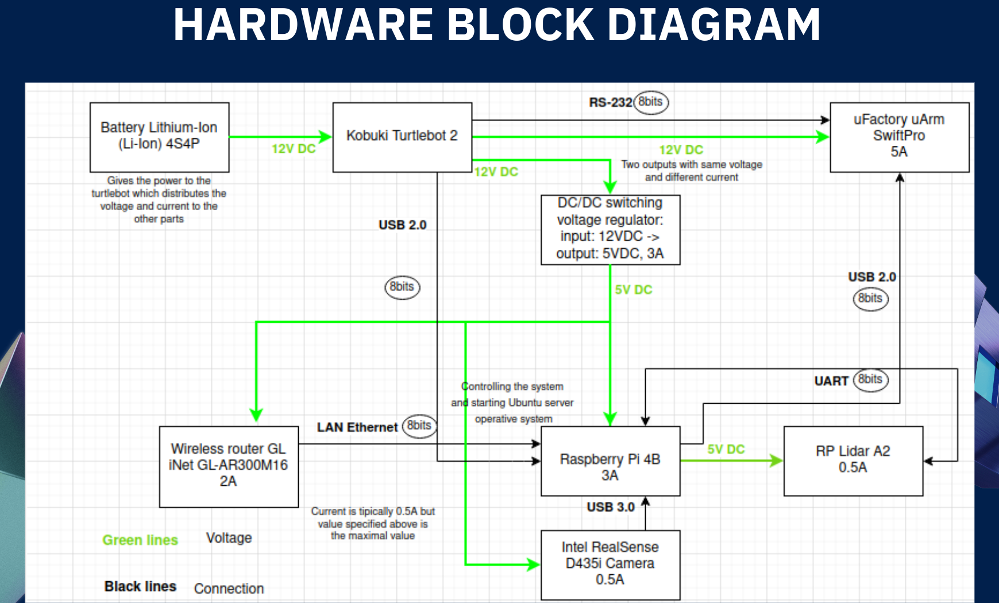
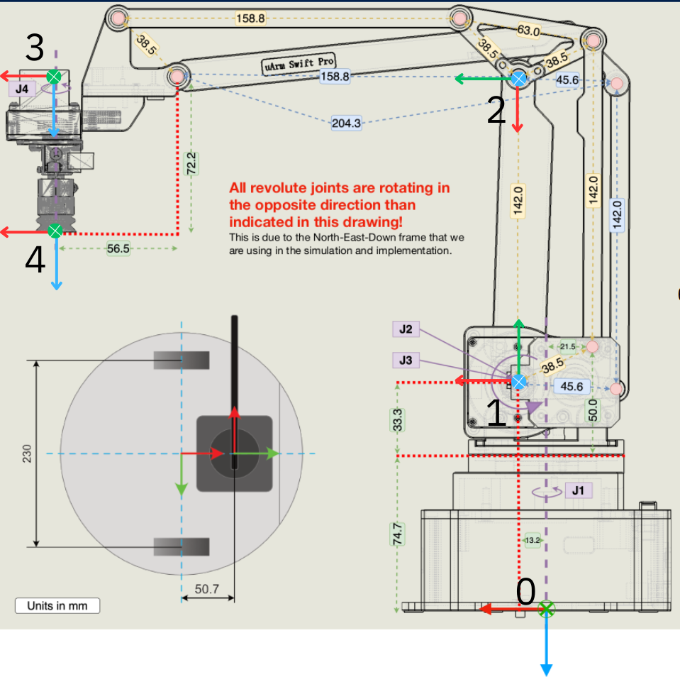
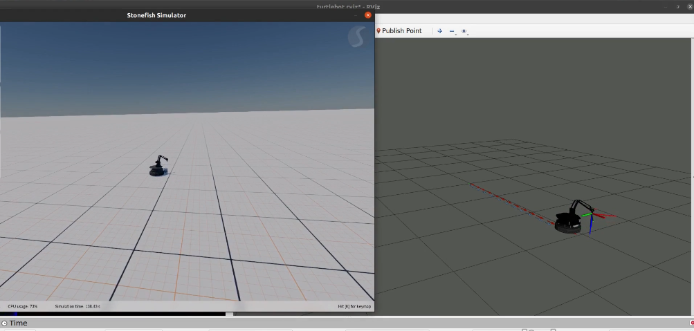

# Hands on Intervention for Pick and Place task using Turtlebot3 robot

This repository is the implementation of the scientific paper titled "Task-Priority Based Redundancy Control of Robot Manipulators," specifically designed for the pick-and-place task.

Furthermore, it integrates the Aruco marker for object detection, enhancing the functionality of the system in identifying objects for manipulation.

# Hardware Architecture

  

# 4 DOF Robotic Arm Kinematics

  

# Task-Priority Based Redundancy Control of Robot Manipulators in Stonefish Simulator

  

# Video Demonstration
Here is a video demonstrating the pick-and-place task using the implemented system:

    <video width="860" height="360" controls>
        <source src="Videos/pick_and_place_real_robot.mp4" type="video/mp4">
    </video>

